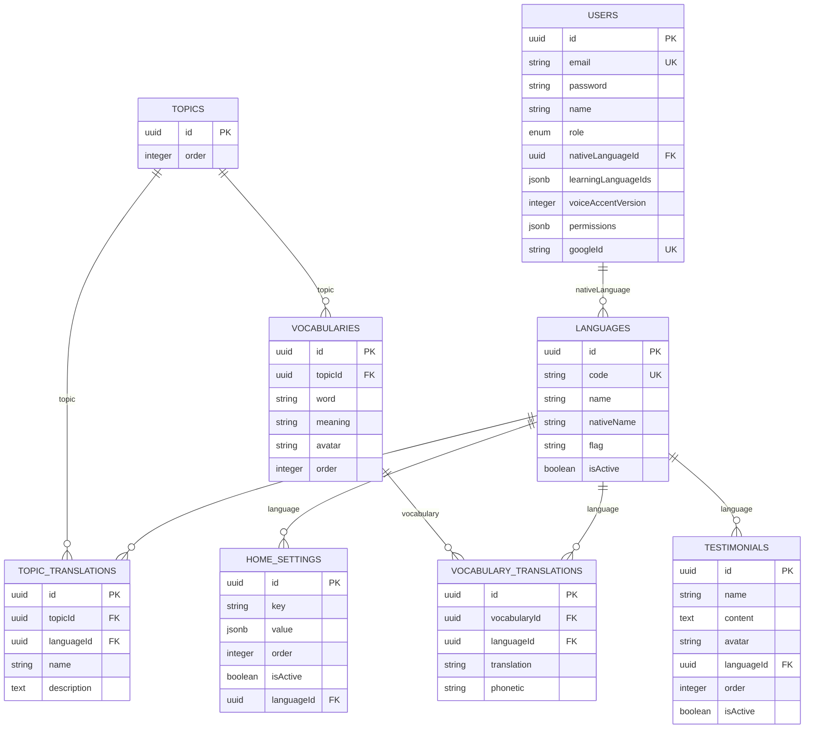

# Database Schema - Goozi

## Tổng Quan

Goozi sử dụng PostgreSQL với Sequelize ORM. Database được quản lý qua migrations và hỗ trợ JSONB cho các fields phức tạp.

## Entity Relationship Diagram



## Tables

### 1. `users`

**Description**: Người dùng hệ thống

**Columns**:
| Column | Type | Constraints | Description |
|--------|------|-------------|-------------|
| `id` | UUID | PRIMARY KEY | User ID |
| `email` | VARCHAR(255) | UNIQUE, NOT NULL | Email đăng nhập |
| `password` | VARCHAR(255) | NULLABLE | Password (hashed với bcrypt) |
| `googleId` | VARCHAR(255) | UNIQUE, NULLABLE | Google OAuth ID |
| `name` | VARCHAR(255) | NOT NULL | Tên user |
| `role` | ENUM('user', 'admin') | DEFAULT 'user' | Vai trò |
| `nativeLanguageId` | UUID | NULLABLE, FK → languages.id | Ngôn ngữ mẹ đẻ |
| `learningLanguageIds` | JSONB | NULLABLE | Array of language IDs: `["uuid1", "uuid2"]` |
| `voiceAccentVersion` | INTEGER | DEFAULT 1, NULLABLE | Phiên bản giọng nói (1-4) |
| `permissions` | JSONB | NULLABLE | Object: `{"topics": true, "vocabularies": true, "home": true, "users": true}` |
| `created_at` | TIMESTAMP | NOT NULL | Ngày tạo |
| `updated_at` | TIMESTAMP | NOT NULL | Ngày cập nhật |

**Indexes**:
- `users_email_unique` on `email`
- `users_googleId_unique` on `googleId`
- Foreign key index on `nativeLanguageId`

**Hooks**:
- `beforeCreate`: Hash password nếu có
- `beforeUpdate`: Hash password nếu thay đổi

**Methods**:
- `comparePassword(candidatePassword)`: So sánh password
- `toJSON()`: Custom serialization, parse JSONB fields

### 2. `languages`

**Description**: Danh sách ngôn ngữ hỗ trợ

**Columns**:
| Column | Type | Constraints | Description |
|--------|------|-------------|-------------|
| `id` | UUID | PRIMARY KEY | Language ID |
| `code` | VARCHAR(10) | UNIQUE, NOT NULL | Mã ngôn ngữ (ISO 639-1): `en`, `ja`, `vi` |
| `name` | VARCHAR(255) | NOT NULL | Tên ngôn ngữ: `English`, `Japanese` |
| `nativeName` | VARCHAR(255) | NULLABLE | Tên bản địa: `English`, `日本語` |
| `flag` | VARCHAR(10) | NULLABLE | Emoji flag: `🇺🇸`, `🇯🇵` |
| `isActive` | BOOLEAN | DEFAULT true | Có active không |

**Indexes**:
- `languages_code_unique` on `code`

### 3. `topics`

**Description**: Chủ đề học

**Columns**:
| Column | Type | Constraints | Description |
|--------|------|-------------|-------------|
| `id` | UUID | PRIMARY KEY | Topic ID |
| `order` | INTEGER | NULLABLE | Thứ tự hiển thị |
| `created_at` | TIMESTAMP | NOT NULL | Ngày tạo |
| `updated_at` | TIMESTAMP | NOT NULL | Ngày cập nhật |

**Relationships**:
- `hasMany` TopicTranslation (as: 'translations')
- `hasMany` Vocabulary

### 4. `topic_translations`

**Description**: Bản dịch tên và mô tả topic theo ngôn ngữ

**Columns**:
| Column | Type | Constraints | Description |
|--------|------|-------------|-------------|
| `id` | UUID | PRIMARY KEY | Translation ID |
| `topicId` | UUID | NOT NULL, FK → topics.id | Topic ID |
| `languageId` | UUID | NOT NULL, FK → languages.id | Language ID |
| `name` | VARCHAR(255) | NULLABLE | Tên topic theo ngôn ngữ |
| `description` | TEXT | NULLABLE | Mô tả topic |

**Indexes**:
- Foreign key indexes on `topicId` and `languageId`
- Unique constraint on `(topicId, languageId)` (nếu có)

### 5. `vocabularies`

**Description**: Từ vựng

**Columns**:
| Column | Type | Constraints | Description |
|--------|------|-------------|-------------|
| `id` | UUID | PRIMARY KEY | Vocabulary ID |
| `topicId` | UUID | NOT NULL, FK → topics.id | Topic ID |
| `word` | VARCHAR(255) | NOT NULL | Từ gốc |
| `meaning` | VARCHAR(255) | NULLABLE | Nghĩa gốc |
| `avatar` | VARCHAR(255) | NULLABLE | URL hình ảnh |
| `order` | INTEGER | NULLABLE | Thứ tự hiển thị |
| `created_at` | TIMESTAMP | NOT NULL | Ngày tạo |
| `updated_at` | TIMESTAMP | NOT NULL | Ngày cập nhật |

**Relationships**:
- `belongsTo` Topic
- `hasMany` VocabularyTranslation (as: 'translations')

### 6. `vocabulary_translations`

**Description**: Bản dịch từ vựng theo ngôn ngữ

**Columns**:
| Column | Type | Constraints | Description |
|--------|------|-------------|-------------|
| `id` | UUID | PRIMARY KEY | Translation ID |
| `vocabularyId` | UUID | NOT NULL, FK → vocabularies.id | Vocabulary ID |
| `languageId` | UUID | NOT NULL, FK → languages.id | Language ID |
| `translation` | VARCHAR(255) | NULLABLE | Bản dịch |
| `phonetic` | VARCHAR(255) | NULLABLE | Phiên âm |

**Indexes**:
- Foreign key indexes on `vocabularyId` and `languageId`
- Unique constraint on `(vocabularyId, languageId)` (nếu có)

### 7. `home_settings`

**Description**: Cấu hình trang chủ (slogan, picture, etc.)

**Columns**:
| Column | Type | Constraints | Description |
|--------|------|-------------|-------------|
| `id` | UUID | PRIMARY KEY | Setting ID |
| `key` | VARCHAR(255) | NOT NULL | Key: `slogan`, `picture`, etc. |
| `value` | JSONB | NULLABLE | Value: JSON string hoặc object |
| `order` | INTEGER | NULLABLE | Thứ tự hiển thị |
| `isActive` | BOOLEAN | DEFAULT true | Có active không |
| `languageId` | UUID | NULLABLE, FK → languages.id | Language ID (optional) |

**Examples**:
- `key = 'slogan'`, `value = '{"en": "Welcome", "ja": "ようこそ"}'` (JSON string)
- `key = 'picture'`, `value = '/uploads/hero.jpg'` (string)

### 8. `testimonials`

**Description**: Đánh giá từ users

**Columns**:
| Column | Type | Constraints | Description |
|--------|------|-------------|-------------|
| `id` | UUID | PRIMARY KEY | Testimonial ID |
| `name` | VARCHAR(255) | NULLABLE | Tên người đánh giá |
| `content` | TEXT | NULLABLE | Nội dung đánh giá |
| `avatar` | VARCHAR(255) | NULLABLE | URL ảnh đại diện |
| `languageId` | UUID | NULLABLE, FK → languages.id | Language ID |
| `order` | INTEGER | NULLABLE | Thứ tự hiển thị |
| `isActive` | BOOLEAN | DEFAULT true | Có active không |
| `created_at` | TIMESTAMP | NOT NULL | Ngày tạo |
| `updated_at` | TIMESTAMP | NOT NULL | Ngày cập nhật |

## Relationships

### User Relationships

```javascript
// User → Language (nativeLanguage)
User.belongsTo(Language, {
  foreignKey: 'nativeLanguageId',
  as: 'nativeLanguage'
});

Language.hasMany(User, {
  foreignKey: 'nativeLanguageId'
});
```

### Topic Relationships

```javascript
// Topic → TopicTranslation
Topic.hasMany(TopicTranslation, {
  foreignKey: 'topicId',
  as: 'translations'
});

TopicTranslation.belongsTo(Topic, {
  foreignKey: 'topicId'
});

TopicTranslation.belongsTo(Language, {
  foreignKey: 'languageId',
  as: 'language'
});

// Topic → Vocabulary
Topic.hasMany(Vocabulary, {
  foreignKey: 'topicId'
});

Vocabulary.belongsTo(Topic, {
  foreignKey: 'topicId'
});
```

### Vocabulary Relationships

```javascript
// Vocabulary → VocabularyTranslation
Vocabulary.hasMany(VocabularyTranslation, {
  foreignKey: 'vocabularyId',
  as: 'translations'
});

VocabularyTranslation.belongsTo(Vocabulary, {
  foreignKey: 'vocabularyId'
});

VocabularyTranslation.belongsTo(Language, {
  foreignKey: 'languageId',
  as: 'language'
});
```

### Home Settings Relationships

```javascript
// HomeSetting → Language (optional)
HomeSetting.belongsTo(Language, {
  foreignKey: 'languageId',
  as: 'language'
});
```

### Testimonial Relationships

```javascript
// Testimonial → Language
Testimonial.belongsTo(Language, {
  foreignKey: 'languageId',
  as: 'language'
});
```

## JSONB Fields

### 1. `users.learningLanguageIds`

**Type**: JSONB Array
**Format**: `["uuid1", "uuid2", ...]`
**Example**: `["764c6db8-5c2c-4629-8155-2938d1d34cd2", "a1b2c3d4-..."]`

**Usage**:
```javascript
// Save
user.learningLanguageIds = ['uuid1', 'uuid2'];

// Query
const users = await User.findAll({
  where: {
    learningLanguageIds: {
      [Op.contains]: ['uuid1']  // Contains specific language ID
    }
  }
});
```

### 2. `users.permissions`

**Type**: JSONB Object
**Format**: `{"topics": true, "vocabularies": true, "home": true, "users": true}`
**Example**: `{"topics": true, "vocabularies": false, "home": true, "users": false}`

**Usage**:
```javascript
// Save
user.permissions = {
  topics: true,
  vocabularies: true,
  home: true,
  users: false
};

// Query
const admins = await User.findAll({
  where: {
    permissions: {
      users: true  // Has users permission
    }
  }
});
```

### 3. `home_settings.value`

**Type**: JSONB (String hoặc Object)
**Format**: 
- String: `'{"en": "Welcome", "ja": "ようこそ"}'`
- Object: `{"en": "Welcome", "ja": "ようこそ"}`

**Usage**:
```javascript
// Save as JSON string
setting.value = JSON.stringify({
  en: "Welcome",
  ja: "ようこそ"
});

// Read and parse
const translations = JSON.parse(setting.value);
const englishSlogan = translations.en;
```

## Indexes

### Primary Indexes
- Tất cả tables có PRIMARY KEY trên `id` (UUID)

### Unique Indexes
- `users.email` - Unique email
- `users.googleId` - Unique Google ID
- `languages.code` - Unique language code

### Foreign Key Indexes
- `users.nativeLanguageId` → `languages.id`
- `topic_translations.topicId` → `topics.id`
- `topic_translations.languageId` → `languages.id`
- `vocabularies.topicId` → `topics.id`
- `vocabulary_translations.vocabularyId` → `vocabularies.id`
- `vocabulary_translations.languageId` → `languages.id`
- `home_settings.languageId` → `languages.id`
- `testimonials.languageId` → `languages.id`

## Migrations

Migrations được quản lý trong `backend/src/migrations/`:

1. `001-create-users.js` - Tạo bảng users
2. `002-create-topics.js` - Tạo bảng topics
3. `003-create-vocabularies.js` - Tạo bảng vocabularies
4. `004-create-languages.js` - Tạo bảng languages
5. `005-add-languages-to-users.js` - Thêm nativeLanguageId
6. `006-add-languages-to-topics.js` - (Deprecated)
7. `007-add-avatar-order-to-vocabularies.js` - Thêm avatar, order
8. `008-create-vocabulary-translations.js` - Tạo vocabulary_translations
9. `009-create-home-settings.js` - Tạo home_settings
10. `010-remove-unique-key-from-home-settings.js` - Xóa unique constraint
11. `011-create-testimonials.js` - Tạo testimonials
12. `012-add-permissions-to-users.js` - Thêm permissions (JSONB)
13. `013-add-order-to-topics.js` - Thêm order
14. `014-create-topic-translations.js` - Tạo topic_translations
15. `015-remove-language-fields-from-topics.js` - Xóa language fields
16. `016-add-google-oauth-to-users.js` - Thêm googleId
17. `017-add-voice-accent-to-users.js` - Thêm voiceAccentVersion
18. `018-add-learning-languages-to-users.js` - Thêm learningLanguageIds (JSONB)

## Query Examples

### Get User with Native Language

```javascript
const user = await User.findByPk(userId, {
  include: [{
    model: Language,
    as: 'nativeLanguage'
  }]
});
```

### Get Topics with Translations

```javascript
const topics = await Topic.findAll({
  include: [{
    model: TopicTranslation,
    as: 'translations',
    include: [{
      model: Language,
      as: 'language'
    }]
  }],
  order: [['order', 'ASC']]
});
```

### Get Vocabularies with Translations

```javascript
const vocabularies = await Vocabulary.findAll({
  where: { topicId },
  include: [{
    model: VocabularyTranslation,
    as: 'translations',
    include: [{
      model: Language,
      as: 'language'
    }]
  }],
  order: [['order', 'ASC']]
});
```

### Query JSONB Fields

```javascript
// Users learning specific language
const users = await User.findAll({
  where: {
    learningLanguageIds: {
      [Op.contains]: [languageId]  // Array contains languageId
    }
  }
});

// Users with specific permission
const admins = await User.findAll({
  where: {
    'permissions.users': true  // JSONB path query
  }
});
```

## Best Practices

1. **Always use UUIDs**: Tất cả primary keys là UUID
2. **JSONB for complex data**: Sử dụng JSONB cho arrays và objects
3. **Foreign keys**: Luôn có foreign key constraints
4. **Indexes**: Index trên foreign keys và unique fields
5. **Timestamps**: Tất cả tables có `created_at` và `updated_at`
6. **Soft deletes**: Có thể thêm `deleted_at` cho soft deletes (chưa implement)

## Related Documentation

- [BACKEND.md](./BACKEND.md) - Backend models và services
- [USER_PREFERENCES.md](./USER_PREFERENCES.md) - User preferences (JSONB fields)
- [MULTI_LANGUAGE.md](./MULTI_LANGUAGE.md) - Multi-language support
